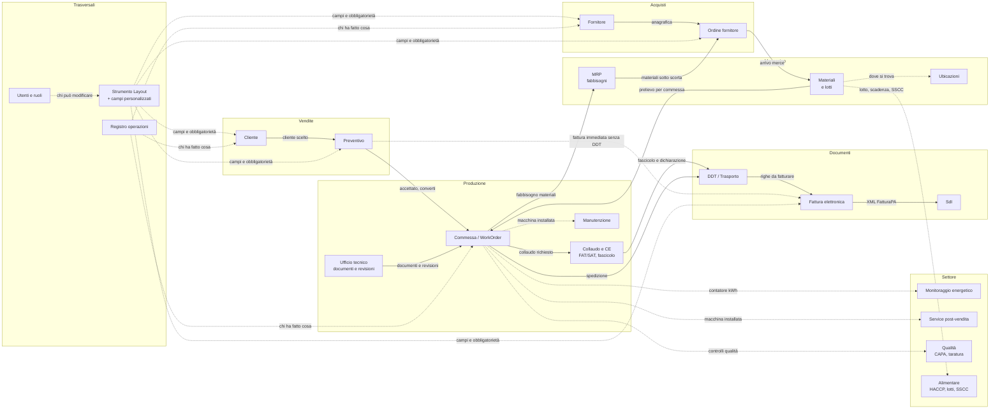

# Diagramma del flusso dei dati tra i moduli — Nicolò MES

Aggiornato all'8 ottobre 2026. Mostra come un dato nasce in un modulo e arriva agli altri, non la struttura del database. Collegato a [STATO-PROGETTO.md](STATO-PROGETTO.md) e [PROJECT-MAP.md](PROJECT-MAP.md).

## 1. Vista d'insieme

Linea continua = il dato passa all'altro modulo e lo alimenta. Linea punteggiata = collegamento di lettura, configurazione o traccia, non un passaggio di dati che genera un nuovo record.

## 2. I flussi principali, con un esempio

### 2.1 Dalla vendita alla fattura
1. **Cliente** → **Preventivo**: si crea un preventivo (web o desktop) scegliendo un cliente già in anagrafica. *Esempio: Condominio Aurora chiede un quadro BT, nasce il preventivo PR-2026-0012.*
2. **Preventivo accettato** → **Commessa**: la conversione crea una commessa in bozza per ogni riga con un prodotto; le righe descrittive (trasporto, posa) restano solo nel preventivo.
3. **Commessa** → **MRP**: la distinta del prodotto genera il fabbisogno di materiali per quella commessa.
4. **MRP** → **Ordine fornitore**: i materiali sotto scorta propongono un ordine, raggruppato per fornitore.
5. **Ordine fornitore** → **Materiali**: l'arrivo merce aggiorna la giacenza, con lotto se tracciato.
6. **Commessa + Materiali** → **DDT**: la spedizione genera il documento di trasporto con le righe della commessa.
7. **DDT** → **Fattura**: la fattura differita (TD24) nasce da uno o più DDT emessi dello stesso cliente, con il prezzo già venduto.
8. **Preventivo o cliente** → **Fattura immediata**: in alternativa, una fattura TD01 si crea direttamente, senza DDT (novità del 7–8 ottobre: anche dalla piattaforma web).
9. **Fattura** → **SdI**: l'XML FatturaPA si scarica per il portale o l'intermediario; lo stato dell'invio si registra sulla fattura.

### 2.2 Dalla commessa ai moduli di settore
- **Commessa → Collaudo e CE**: a fine produzione nasce il collaudo FAT/SAT, che collega i documenti già versionati dall'Ufficio tecnico e genera la dichiarazione di conformità.
- **Commessa → Manutenzione e Service**: una volta spedita, la macchina installata collegata alla commessa nasce nel modulo Service; gli interventi di manutenzione la referenziano.
- **Macchina installata → Monitoraggio energetico**: le letture del contatore kWh si collegano alla macchina e, a cascata, alla commessa che l'ha generata.
- **Materiali → Alimentare**: lotto, scadenza ed etichetta SSCC seguono il materiale nel settore alimentare, compreso il richiamo se serve.

### 2.3 I moduli trasversali
- **Strumento Layout**: non genera dati di business, ma decide quali campi un modulo mostra, con quale etichetta e se sono obbligatori — compresi i campi personalizzati che l'Admin aggiunge senza toccare il codice (es. "Giorni di pagamento" su Fornitori e Clienti). Oggi copre 12 schermate su circa 70.
- **Utenti e ruoli**: decide chi può modificare un layout, chi vede un modulo (es. Fatture solo ad Admin, Sales, Management), chi autentica su quale canale.
- **Registro operazioni**: non alimenta i moduli, li osserva: ogni creazione, modifica o azione rilevante lascia una traccia con chi, cosa e quando. Copre 28 controller su 51.

## 3. Cosa manca in questo diagramma

- Non mostra ancora un collegamento esplicito tra **Pianificazione (Planning/PlanningBoard)** e **capacità finita** verso la Commessa: il fabbisogno di tempo macchina non è nel disegno.
- Non mostra i moduli di **assistenza IA** e **licenza**, che sono trasversali ma non toccano il flusso dei dati di business.
- È la base su cui progettare lo **strumento per creare e collegare flussi di dati dal pannello Admin**, richiesto l'8 ottobre 2026: quel che manca qui (e l'ambito dello strumento) va chiarito prima di disegnarlo.
