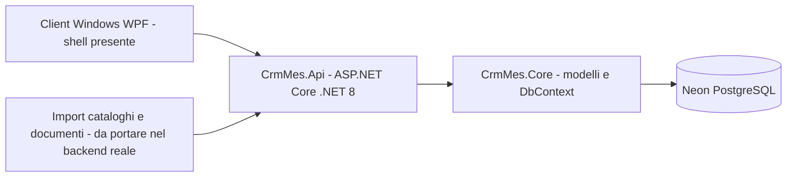

# Mappa progetto Gestionale Elettrico

Aggiornata: 2026-09-17

## Visione architetturale

## Gia costruito e verificato

### Backend reale .NET

- Soluzione `CrmMes.sln`.
- `CrmMes.Api`: API ASP.NET Core .NET 8.
- `CrmMes.Core`: modelli condivisi e `ApplicationDbContext`.
- Swagger disponibile in ambiente Development.
- Health check disponibile su `GET /health`.
- Connessione Neon PostgreSQL configurata tramite User Secrets.
- Migrazioni EF Core applicate a Neon: `InitialCreate`, `AddUserAuthentication`, `AddPurchaseOrderReceiving`, `AddLowStockReordering`.
- Build verificata con 0 errori e 0 warning.

### Modello dati presente

- Utenti.
- Aree.
- Materiali.
- Fornitori.
- Relazione materiale-fornitore.
- Distinte di prelievo.
- Righe distinta.
- Materiali mancanti: `WithdrawalSlipId` reso opzionale per supportare richieste generate da sottoscorta senza distinta di origine.
- Ordini di acquisto: aggiunti `ConfirmedAt` e `ReceivedAt`.
- Righe ordine di acquisto: aggiunti `ReceivedQuantity` e collegamento opzionale a `MissingMaterial`.
- Log di audit.

### API gia disponibili

- `GET /health`
- `GET /api/health/status`
- `GET /api/materials`
- `GET /api/materials/{id}`
- `POST /api/materials`
- `DELETE /api/materials/{id}`: disattivazione logica
- `GET /api/users`
- `POST /api/users`
- `GET /api/areas`
- `POST /api/areas`
- `POST /api/withdrawal-slips`
- `GET /api/withdrawal-slips/{id}`
- `POST /api/withdrawal-slips/{id}/close`: chiusura autenticata e scarico stock transazionale
- `POST /api/withdrawal-slips/{id}/ready`: passaggio Draft -> Ready senza mancanti
- `POST /api/auth/register`
- `POST /api/auth/login`
- `GET /api/procurement/missing`
- `GET /api/procurement/low-stock`: materiali attivi sotto la scorta minima, con quantità suggerita e flag se già richiesti
- `POST /api/procurement/low-stock/scan`: crea materiali mancanti (Source `MinStock`) per i materiali sotto minimo non ancora richiesti
- `POST /api/procurement/purchase-orders`
- `GET /api/procurement/purchase-orders`
- `GET /api/procurement/purchase-orders/{id}`
- `POST /api/procurement/purchase-orders/{id}/confirm`: passaggio Draft -> Confirmed
- `POST /api/procurement/purchase-orders/{id}/receive`: ricezione merce (anche parziale), scarico automatico del materiale mancante collegato e carico stock transazionale
- `POST /api/procurement/purchase-orders/{id}/cancel`: annullamento ordine, riapertura dei materiali mancanti collegati
- `GET /api/supplier-catalog/search?q=...`
- `POST /api/supplier-catalog/import-csv`

### Flusso verificato su Neon

1. Creazione area.
2. Creazione utente.
3. Creazione materiale.
4. Creazione distinta.
5. Confronto codice con catalogo Neon.
6. Rilevamento stock insufficiente.
7. Creazione automatica del materiale mancante.
8. Registrazione e login utente reale con generazione JWT.
9. Rilevamento materiale sotto scorta minima (`GET /api/procurement/low-stock`), creazione automatica del materiale mancante tramite scan (`POST /api/procurement/low-stock/scan`) con quantità suggerita = scorta minima - giacenza, e idempotenza (scan ripetuto non duplica la richiesta).
10. Applicazione policy di autorizzazione per ruolo verificata (403 per utente senza ruolo sufficiente).
11. Login dal client desktop WPF con utente reale, API locale collegata a Neon tramite User Secrets.

## Prototipo esistente

Il progetto contiene ancora il primo MVP Node/Express:

- `server.js`.
- `public/index.html`.
- `data/store.json`.
- Import PDF, fogli di calcolo e documenti.
- Import cataloghi Schneider/Pizzato tramite file.
- Ricerca rapida locale e fallback di ricerca esterna.

Il prototipo è utile come riferimento funzionale, ma non deve essere usato come database di produzione. La direzione ufficiale è `.NET API + Neon + client Windows`.

## Cosa manca

### Priorita 1: completare il backend operativo

- Autorizzazione per endpoint e ruoli: policy JWT presenti per Admin, Warehouse, Purchasing e la nuova policy combinata `PurchasingOrWarehouse` (ricezione ordini).
- Ruoli: amministratore, magazzino, acquisti, operatore.
- Associazione utenti-aree presente; controllo accesso per area sulle distinte ancora da completare.
- Bootstrap utente Admin ancora da implementare: la registrazione pubblica crea solo `Operator` e la creazione utenti con ruolo richiede già la policy `AdminOnly`, quindi il primo Admin va creato manualmente sul database.
- Elenco e modifica delle distinte.
- Modifica e annullamento delle distinte.
- Ciclo ordini di acquisto Draft -> Confirmed -> PartiallyReceived/Received implementato e testato su Neon, con annullamento e collegamento ai materiali mancanti; modifica righe ordine dopo la creazione ancora da implementare.
- Gestione sottoscorte (ordine minimo) implementata e testata su Neon: rilevamento materiali sotto `MinStock`, creazione automatica del materiale mancante alla chiusura di una distinta che porta un materiale sotto minimo, scan manuale (`POST /api/procurement/low-stock/scan`) per i casi non coperti da un prelievo (es. correzioni manuali di giacenza).
- Audit log scritto automaticamente per creazione, conferma, ricezione e annullamento ordini di acquisto e per lo scan sottoscorte; le operazioni sulle distinte di prelievo (creazione, pronta, chiusura, annullamento) non scrivono ancora audit log.
- Validazione e gestione degli errori uniforme.

### Priorita 2: import e cataloghi

- Portare nel backend .NET l’import di Excel/PDF oltre al CSV già disponibile.
- Definire il formato ufficiale dei cataloghi Schneider e Pizzato.
- Deduplicazione per codice produttore.
- Storico versioni del catalogo.
- Ricerca esterna controllata quando il codice non è catalogato.
- Gestione manuale dei codici non riconosciuti.

### Priorita 3: client Windows

- Login: implementato.
- Controllo release GitHub e auto-update da asset ZIP: implementato (nessuna release pubblicata ancora, quindi il controllo restituisce "nessuna release trovata").
- Dashboard a schede: implementata (materiali, sotto scorta, materiali mancanti, distinte, ordini fornitore, aree, utenti).
- Ricerca materiali: implementata.
- Lista materiali mancanti e sottoscorte, con scan sottoscorte da UI: implementata.
- Ordini fornitore: elenco, conferma, ricezione residuo, annullamento da UI implementati; creazione ordine da UI ancora da fare.
- Creazione distinta da UI: ancora da fare.
- Importazione file: ancora da fare.
- Stampe ed esportazione PDF/Excel: ancora da fare.
- Configurazione URL API e gestione offline/connessione assente: ancora da fare (URL API fisso su localhost).

### Priorita 4: produzione

- Hosting pubblico dell’API.
- HTTPS e dominio.
- Gestione segreti nel provider di hosting.
- Backup e monitoraggio Neon.
- Logging centralizzato.
- Pipeline CI/CD.
- Test automatici API e integrazione database.
- Installer Windows e aggiornamenti dell’applicazione.
- Pubblicazione release con asset `CrmMes.Desktop-win-x64.zip`.

## Stato sintetico

| Area | Stato | Note |
|---|---|---|
| Architettura backend | Completata | ASP.NET Core + Neon |
| Database | Operativo | Migrazione iniziale applicata |
| Modelli dati | Base completata | Mancano regole e vincoli avanzati |
| API materiali | Operativa | CRUD iniziale |
| API utenti/aree | Operativa con policy | Mancano bootstrap Admin e controllo area sulle distinte |
| API distinte | Operativa | Mancano modifica, riapertura e audit |
| Ordini fornitori | Draft, Confirmed, PartiallyReceived, Received, Cancelled | Testato end-to-end su Neon. Manca modifica righe dopo creazione |
| Sottoscorte / ordine minimo | Operativa | Rilevamento automatico alla chiusura distinta + scan manuale, testato su Neon e richiamabile dal client Windows |
| Cataloghi fornitori | CSV e ricerca operative | Mancano Excel/PDF e connettori ufficiali |
| Import documenti | Nel prototipo Node | Da portare nel backend reale |
| Autenticazione | JWT e policy operative | Mancano bootstrap Admin, refresh token e test automatici |
| Client Windows | Dashboard a schede: materiali, sotto scorta, materiali mancanti, distinte, ordini fornitore, aree, utenti | Sola visualizzazione per la maggior parte delle schede; azioni disponibili solo su ordini fornitore (conferma/ricevi/annulla) e scan sottoscorte. Mancano creazione distinta e import file |
| Auto-update | Implementato | Richiede release GitHub con asset previsto |
| Deploy produzione | Mancante | API attualmente locale |

## Prossimo incremento consigliato

1. Aggiungere audit log anche alle operazioni sulle distinte di prelievo (creazione, pronta, chiusura, annullamento), per coerenza con quanto fatto sugli ordini di acquisto.
2. Portare l’import cataloghi nel backend .NET.
3. Aggiungere al client WPF le operazioni di scrittura ancora mancanti: creazione distinta, creazione ordine fornitore, import file; e un vero bootstrap dell'utente Admin (oggi il primo Admin va creato manualmente sul database).
