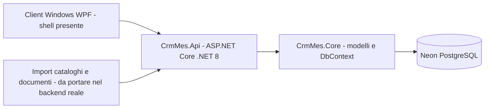

# Mappa progetto Gestionale Elettrico

Aggiornata: 2026-09-18

## Visione architetturale

## Gia costruito e verificato

### Backend reale .NET

- Soluzione `CrmMes.sln`.
- `CrmMes.Api`: API ASP.NET Core .NET 8.
- `CrmMes.Core`: modelli condivisi e `ApplicationDbContext`.
- Swagger disponibile in ambiente Development.
- Health check disponibile su `GET /health`.
- Connessione Neon PostgreSQL configurata tramite User Secrets.
- Migrazioni EF Core applicate a Neon: `InitialCreate`, `AddUserAuthentication`, `AddPurchaseOrderReceiving`, `AddLowStockReordering`.
- Build verificata con 0 errori e 0 warning su tutti i 4 progetti (`CrmMes.Api`, `CrmMes.Core`, `CrmMes.Desktop`, `CrmMes.Api.Tests`).
- Gestione errori centralizzata: `UseExceptionHandler()` + `AddProblemDetails()` (risposte RFC 9110 uniformi; dettaglio dell'eccezione incluso solo in ambiente Development).
- HSTS attivo fuori da Development.
- Logging delle richieste HTTP (`UseHttpLogging`, metodo/percorso/stato/durata).
- Compressione delle risposte (gzip) abilitata.
- `CrmMes.Api.Tests`: 38 test di integrazione (xUnit + `WebApplicationFactory` + Sqlite in-memory, non toccano mai Neon) che coprono autenticazione, refresh token, bootstrap Admin, policy di autorizzazione per ruolo, ciclo distinte di prelievo (incluse le modifiche), sottoscorte, ciclo ordini fornitore (incluse le modifiche) e import catalogo CSV/Excel. Eseguibili con `dotnet test CrmMes.Api.Tests`.
- Workflow GitHub Actions (`.github/workflows/build.yml`): build + test automatici su push/PR verso `main`.
- Refresh token: login/registrazione restituiscono un access token di 30 minuti + un refresh token di 30 giorni (rotazione ad ogni uso, revoca su logout). Endpoint `POST /api/auth/refresh` e `POST /api/auth/logout`. Il client desktop rinnova automaticamente in background prima della scadenza.
- Import catalogo Excel (`POST /api/supplier-catalog/import-excel`, libreria ClosedXML, MIT): stessa logica di upsert del CSV, condivisa tramite un metodo comune.

### Modello dati presente

- Utenti.
- Aree.
- Materiali.
- Fornitori.
- Relazione materiale-fornitore.
- Distinte di prelievo.
- Righe distinta.
- Materiali mancanti: `WithdrawalSlipId` reso opzionale per supportare richieste generate da sottoscorta senza distinta di origine.
- Ordini di acquisto: aggiunti `ConfirmedAt` e `ReceivedAt`.
- Righe ordine di acquisto: aggiunti `ReceivedQuantity` e collegamento opzionale a `MissingMaterial`.
- Log di audit.
- Refresh token: tabella dedicata con hash del token (mai salvato in chiaro), scadenza, revoca e collegamento al token successivo (rotazione).

### API gia disponibili

- `GET /health`
- `GET /api/health/status`
- `GET /api/materials`
- `GET /api/materials/{id}`
- `POST /api/materials`
- `DELETE /api/materials/{id}`: disattivazione logica
- `GET /api/users`
- `POST /api/users`: crea utente con ruolo e password impostati dall'Admin (prima creava utenti senza password, quindi inutilizzabili al login)
- `GET /api/areas`
- `POST /api/areas`
- `GET /api/suppliers`
- `POST /api/suppliers`
- `POST /api/withdrawal-slips`
- `GET /api/withdrawal-slips/{id}`
- `PUT /api/withdrawal-slips/{id}`: modifica note e righe, solo per distinte in bozza
- `POST /api/withdrawal-slips/{id}/close`: chiusura autenticata e scarico stock transazionale; blocca anche la chiusura di una distinta già annullata (bug corretto: prima lo permetteva, scaricando lo stock per errore)
- `POST /api/withdrawal-slips/{id}/ready`: passaggio Draft -> Ready senza mancanti
- `POST /api/auth/register`: il primissimo utente registrato sul database diventa Admin (bootstrap), i successivi Operator
- `POST /api/auth/login`
- `POST /api/auth/refresh`: rinnova access e refresh token (rotazione)
- `POST /api/auth/logout`: revoca il refresh token
- `GET /api/procurement/missing`
- `GET /api/procurement/low-stock`: materiali attivi sotto la scorta minima, con quantità suggerita e flag se già richiesti
- `POST /api/procurement/low-stock/scan`: crea materiali mancanti (Source `MinStock`) per i materiali sotto minimo non ancora richiesti
- `POST /api/procurement/purchase-orders`
- `GET /api/procurement/purchase-orders`
- `GET /api/procurement/purchase-orders/{id}`
- `PUT /api/procurement/purchase-orders/{id}`: modifica fornitore e righe, solo per ordini in bozza; riapre i materiali mancanti scollegati e ricollega quelli ancora referenziati
- `POST /api/procurement/purchase-orders/{id}/confirm`: passaggio Draft -> Confirmed
- `POST /api/procurement/purchase-orders/{id}/receive`: ricezione merce (anche parziale), scarico automatico del materiale mancante collegato e carico stock transazionale
- `POST /api/procurement/purchase-orders/{id}/cancel`: annullamento ordine, riapertura dei materiali mancanti collegati
- `GET /api/supplier-catalog/search?q=...`
- `POST /api/supplier-catalog/import-csv`
- `POST /api/supplier-catalog/import-excel`: stessa logica del CSV, per file .xlsx

### Flusso verificato su Neon

1. Creazione area.
2. Creazione utente.
3. Creazione materiale.
4. Creazione distinta.
5. Confronto codice con catalogo Neon.
6. Rilevamento stock insufficiente.
7. Creazione automatica del materiale mancante.
8. Registrazione e login utente reale con generazione JWT.
9. Rilevamento materiale sotto scorta minima (`GET /api/procurement/low-stock`), creazione automatica del materiale mancante tramite scan (`POST /api/procurement/low-stock/scan`) con quantità suggerita = scorta minima - giacenza, e idempotenza (scan ripetuto non duplica la richiesta).
10. Applicazione policy di autorizzazione per ruolo verificata (403 per utente senza ruolo sufficiente).
11. Login dal client desktop WPF con utente reale, API locale collegata a Neon tramite User Secrets.

## Prototipo esistente

Il progetto contiene ancora il primo MVP Node/Express:

- `server.js`.
- `public/index.html`.
- `data/store.json`.
- Import PDF, fogli di calcolo e documenti.
- Import cataloghi Schneider/Pizzato tramite file.
- Ricerca rapida locale e fallback di ricerca esterna.

Il prototipo è utile come riferimento funzionale, ma non deve essere usato come database di produzione. La direzione ufficiale è `.NET API + Neon + client Windows`.

## Cosa manca

### Priorita 1: completare il backend operativo

- Autorizzazione per endpoint e ruoli: policy JWT presenti per Admin, Warehouse, Purchasing e la policy combinata `PurchasingOrWarehouse` (ricezione ordini, sottoscorte).
- Ruoli: amministratore, magazzino, acquisti, operatore.
- Associazione utenti-aree presente; controllo accesso per area sulle distinte ancora da completare.
- Bootstrap utente Admin implementato: il primo utente registrato diventa Admin automaticamente; `POST /api/users` permette ora a un Admin di creare utenti con ruolo e password specifici (prima creava solo Operator senza password).
- Elenco, modifica (solo in bozza) e annullamento delle distinte implementati.
- Ciclo ordini di acquisto Draft -> Confirmed -> PartiallyReceived/Received implementato e testato su Neon, con annullamento, modifica (solo in bozza) e collegamento ai materiali mancanti.
- Gestione sottoscorte (ordine minimo) implementata e testata su Neon: rilevamento materiali sotto `MinStock`, creazione automatica del materiale mancante alla chiusura di una distinta che porta un materiale sotto minimo, scan manuale (`POST /api/procurement/low-stock/scan`) per i casi non coperti da un prelievo (es. correzioni manuali di giacenza).
- Audit log scritto automaticamente per creazione, conferma, ricezione e annullamento ordini di acquisto, per lo scan sottoscorte, e ora anche per le distinte di prelievo (creazione, pronta, chiusura, annullamento) e la creazione utenti.
- Validazione e gestione degli errori uniforme; gestione errori non previsti centralizzata con ProblemDetails.
- Policy `Warehouse` aggiunta anche a `DELETE /api/materials/{id}` (prima qualsiasi utente autenticato poteva disattivare un materiale).
- Codici auto-generati di distinte e ordini fornitore (`DP-...`, `OD-...`) ora includono un suffisso casuale: il solo timestamp al secondo poteva generare codici duplicati se due venivano creati nello stesso secondo (violazione del vincolo di unicità), scoperto scrivendo i test di integrazione.
- Refresh token implementato: access token ridotto da 8 ore a 30 minuti, refresh token di 30 giorni con rotazione a ogni utilizzo e revoca su logout.
- Bug corretto scrivendo i test: aggiungere una riga a una distinta/ordine già esistente durante una modifica veniva registrato come "aggiornamento" invece che "nuova riga" da Entity Framework, causando un errore. Interessava solo il percorso di modifica, non quello di creazione.

### Priorita 2: import e cataloghi

- Import Excel portato nel backend .NET (`POST /api/supplier-catalog/import-excel`), stessa logica del CSV già disponibile.
- Import PDF non ancora implementato: l'estrazione affidabile di tabelle da PDF richiede un formato di riferimento fisso (i cataloghi Schneider/Pizzato non ne hanno uno standardizzato); da valutare insieme a un esempio di file reale prima di investirci.
- Definire il formato ufficiale dei cataloghi Schneider e Pizzato.
- Deduplicazione per codice produttore.
- Storico versioni del catalogo.
- Ricerca esterna controllata quando il codice non è catalogato.
- Gestione manuale dei codici non riconosciuti.

### Priorita 3: client Windows

- Login: implementato (attualmente disattivato temporaneamente con auto-login di test, vedi `SkipLoginForTesting` in `MainWindow.xaml.cs`).
- Controllo release GitHub e auto-update da asset ZIP: implementato (nessuna release pubblicata ancora, quindi il controllo restituisce "nessuna release trovata").
- Interfaccia con chrome personalizzato (barra del titolo su misura) e sidebar di navigazione a icone al posto delle tab orizzontali.
- Dashboard a schede: materiali, sotto scorta, materiali mancanti, distinte, ordini fornitore, aree, utenti.
- Ricerca materiali: implementata; creazione materiale da UI implementata.
- Lista materiali mancanti e sottoscorte, con scan sottoscorte da UI: implementata.
- Distinte di prelievo: creazione, modifica (solo in bozza), apertura per consultazione (dettaglio righe), segna pronta, chiudi, annulla da UI implementati.
- Ordini fornitore: creazione, modifica (solo in bozza), elenco, conferma, ricezione residuo, annullamento da UI implementati.
- Fornitori: creazione da UI implementata (endpoint mancante fino a questa sessione).
- Aree e utenti: creazione da UI implementata (creazione utente richiede ora ruolo e password).
- Importazione catalogo Excel da UI implementata (pulsante "Importa catalogo Excel" nella scheda Materiali).
- Sessione con refresh token automatico in background (rinnovo silenzioso prima della scadenza dell'access token).
- Importazione distinta da file, stampe ed esportazione PDF/Excel delle liste: ancora da fare.
- Configurazione URL API e gestione offline/connessione assente: ancora da fare (URL API fisso su localhost).

### Priorita 4: produzione

- Preparati (non testati con una build Docker reale, perché Docker non è installato in questo ambiente): `CrmMes.Api/Dockerfile` (multi-stage, .NET 8), `docker-compose.yml` e `.env.example` alla radice del repo, per eseguire l'API in container puntando comunque al database Neon reale. Nessun hosting scelto ancora: opzioni valutate Railway/Fly.io (più semplici, deploy diretto da Dockerfile), Azure App Service (se serve integrazione con altri servizi Microsoft), o un VPS proprio (più controllo, più manutenzione).
- Hosting pubblico dell’API.
- HTTPS e dominio (HSTS già attivo lato codice, manca il dominio/certificato reale).
- Gestione segreti nel provider di hosting.
- Backup e monitoraggio Neon.
- Logging centralizzato: richieste HTTP già loggate (`UseHttpLogging`), manca un sink esterno (es. aggregatore log) per la produzione.
- Pipeline CI/CD: build + test automatici su GitHub Actions implementati (`.github/workflows/build.yml`); manca ancora il deploy automatico.
- Test automatici API e integrazione database: implementati, 23 test su database Sqlite in-memory isolato (mai contro Neon).
- Installer Windows e aggiornamenti dell’applicazione.
- Pubblicazione release con asset `CrmMes.Desktop-win-x64.zip`.

## Stato sintetico

| Area | Stato | Note |
|---|---|---|
| Architettura backend | Completata | ASP.NET Core + Neon |
| Database | Operativo | Migrazione iniziale applicata |
| Modelli dati | Base completata | Mancano regole e vincoli avanzati |
| API materiali | Operativa | CRUD iniziale |
| API utenti/aree | Operativa con policy, bootstrap Admin e creazione utenti con ruolo/password | Manca controllo area sulle distinte per utenti non elevati in fase di lista |
| API distinte | Operativa, con audit log e modifica righe (solo in bozza) | Nessuna lacuna nota |
| Ordini fornitori | Draft, Confirmed, PartiallyReceived, Received, Cancelled, con modifica righe (solo in bozza) | Testato end-to-end su Neon |
| Sottoscorte / ordine minimo | Operativa | Rilevamento automatico alla chiusura distinta + scan manuale, testato su Neon e richiamabile dal client Windows |
| Cataloghi fornitori | CSV ed Excel operativi, ricerca operativa | Manca import PDF e connettori ufficiali Schneider/Pizzato |
| Import documenti | Nel prototipo Node | Da portare nel backend reale |
| Autenticazione | JWT, policy, bootstrap Admin e refresh token operativi | Nessuna lacuna nota |
| Client Windows | Dashboard a schede con creazione/modifica/gestione per materiali, distinte, ordini fornitore, fornitori, aree, utenti, import catalogo Excel | Mancano import distinta da file, stampe/export, gestione offline |
| Auto-update | Implementato | Richiede release GitHub con asset previsto |
| Test automatici | 38 test di integrazione API (xUnit, Sqlite in-memory) | Manca copertura sul client WPF |
| CI | Build + test su GitHub Actions ad ogni push/PR | Manca deploy automatico |
| Deploy produzione | Mancante | API attualmente locale; richiede una decisione su hosting/dominio |

## Prossimo incremento consigliato

1. Riattivare il login manuale nel client (`SkipLoginForTesting = false` in `MainWindow.xaml.cs`) prima di qualsiasi uso reale/condiviso dell'app.
2. Decidere il provider di hosting per l'API (Azure, Railway, Fly.io, VPS...) per poter preparare Dockerfile/pipeline di deploy reale.
3. Valutare l'import PDF con un esempio reale di catalogo fornitore, per definire un formato di riferimento prima di implementarlo.
4. Aggiungere test automatici anche sul client WPF, e più copertura sui casi limite dell'API (es. concorrenza su chiusura distinta/ricezione ordine).
5. Importazione distinta da file esterno, stampe ed esportazione PDF/Excel dal client, gestione offline.
